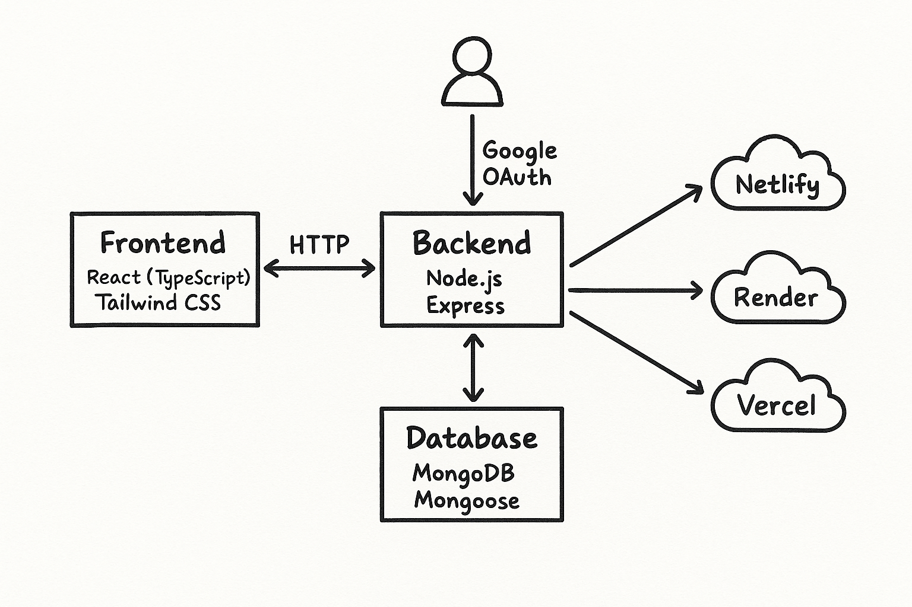

# 👑 CodeThrone - Your Coder Army

Welcome to **CodeThrone**, a comprehensive full-stack competitive programming platform designed to enhance coding skills, collaboration, and learning through interactive contests, discussions, and real-time chat features. Built with modern web technologies, CodeThrone follows industry best practices for scalability, maintainability, and exceptional user experience.

---

## 🔗 Links
- **Live Application:** [https://codestar-fullstack.onrender.com/](https://codestar-fullstack.onrender.com/)
- **Repository:** [https://github.com/aakashc23/LeetcodeClone](https://github.com/aakashc23/LeetcodeClone)
- **Developer LinkedIn:** [Aakash Chaurasia](https://www.linkedin.com/in/aakash-chaurasia-95)

---

## 📖 Table of Contents
- [Overview](#overview)
- [Features](#features)
- [Project Structure](#project-structure)
- [Technologies Used](#technologies-used)
- [Setup & Installation](#setup--installation)
- [Usage Guide](#usage-guide)
- [System Architecture](#system-architecture)
- [Contributing](#contributing)
- [License](#license)

---

## 🎯 Overview
**CodeThrone** is a full-stack web application that brings together competitive programming, collaborative problem-solving, and social interaction. Users can participate in coding contests, discuss optimal solutions, chat in real-time, and track their algorithmic progress. The platform is ideal for students, professionals, and coding enthusiasts looking to improve their problem-solving skills and connect with a global community.

---

## ✨ Features
- **💻 Problem Playground:** Practice problems with a built-in code editor supporting C, C++, Java, and Python.
- **🏆 Coding Contests:** Participate in timed contests, solve algorithmic problems, and climb the global leaderboards.
- **🤖 AI Analysis & Auto-Heal:** Integrated AI features to assist in learning, including an automated Problem of the Day (POTD) system.
- **💬 Discussion Forums:** Engage in topic-based discussions, share insights, and ask architectural questions.
- **⚡ Real-Time Chat:** Communicate instantly with other users in chat rooms and via direct messages.
- **📈 User Profiles:** Track achievements, submission history, and personal growth metrics.
- **🛡️ Admin Dashboard:** Comprehensive dashboard to manage contests, users, problems, and platform content.

---

## 🛠️ Technologies Used

### Frontend
- **React.js (TypeScript)** - UI Library
- **Tailwind CSS** - Utility-first styling
- **Vite** - Lightning-fast build tool
- **Socket.io-client** - Real-time communication

### Backend
- **Node.js & Express.js** - Server framework
- **MongoDB & Mongoose** - NoSQL Database
- **Socket.io** - WebSocket implementation
- **Passport.js** - Authentication strategy
- **Judge0 API** - Secure code execution engine
- **Google Gemini API** - AI features integration

---

## 🏗️ Project Structure
\`\`\`text
root/
├── backend/         # Node.js Express backend, models, routes, services
├── client/          # Frontend source (React)
├── public/          # Static assets
├── server/          # Server entry point
├── src/             # Main frontend app (TypeScript, React)
│   ├── components/  # Reusable UI components
│   ├── config/      # API configuration
│   ├── contexts/    # React context providers
│   ├── pages/       # Application pages (Home, Contest, Chat, etc.)
│   └── utils/       # Utility functions
├── build.sh         # CI/CD Build script
├── start.sh         # Production start script
├── package.json     # Project dependencies
└── vite.config.ts   # Vite configuration
\`\`\`

---

## 🚀 Setup & Installation

### 1. Clone the Repository
\`\`\`bash
git clone https://github.com/aakashc23/LeetcodeClone.git
cd LeetcodeClone
\`\`\`

### 2. Install Dependencies
Install dependencies for both the backend and frontend:
\`\`\`bash
# Backend
cd backend
npm install

# Frontend
cd ../
npm install
\`\`\`

### 3. Environment Variables
Create a \`.env\` file in the root directory (\`/LeetcodeClone\`) and populate it with the required keys:

\`\`\`env
# Database
MONGODB_URI=your_mongodb_connection_string

# Authentication
JWT_SECRET=your_jwt_secret
GOOGLE_CLIENT_ID=your_google_client_id
GOOGLE_CLIENT_SECRET=your_google_client_secret

# AI & Code Execution APIs
GEMINI_API_KEY=your_gemini_api_key
VITE_GEMINI_API_KEY=your_gemini_api_key
JUDGE0_API_KEY_1=your_judge0_key_1
JUDGE0_API_KEY=your_judge0_key

# Server Config
PORT=5000
NODE_ENV=development
\`\`\`

### 4. Run the Application locally
You can start both servers simultaneously in development mode:
\`\`\`bash
# Start backend
cd backend
npm run dev

# Start frontend (in a new terminal)
cd ..
npm run dev
\`\`\`

---

## 📚 Usage Guide
- **Contests:** Navigate to the Contest page to join ongoing or upcoming contests. Problems are displayed with a timer and a live leaderboard.
- **Playground:** Use the Playground for practicing problems, testing code against sample inputs, and submitting solutions for verification.
- **Chat:** Access chat rooms for real-time communication with the community.
- **Admin:** Admins have exclusive access to a robust dashboard for managing platform content (e.g., creating new problems, setting up contests).

---

## 🏛️ System Architecture

---

## 🤝 Contributing
Contributions are highly appreciated! Whether it's reporting a bug, proposing a feature, or submitting a pull request, your help makes CodeThrone better.
- Please read the [PROJECT_DOCUMENTATION.md](PROJECT_DOCUMENTATION.md) for contribution guidelines.
- **Architecture Documentation:** [Overleaf Document](https://www.overleaf.com/project/6887866a503f301b8803b6ff)

---

## 📄 License
This project is licensed under the MIT License.

---

## 📬 Contact & Support
Developed by **[Aakash Chaurasia](https://www.linkedin.com/in/aakash-chaurasia-95)**.  
For questions, suggestions, or support, please open an issue in the GitHub repository or reach out via LinkedIn.

---
*Thank you for being a part of Building Wonders!*
